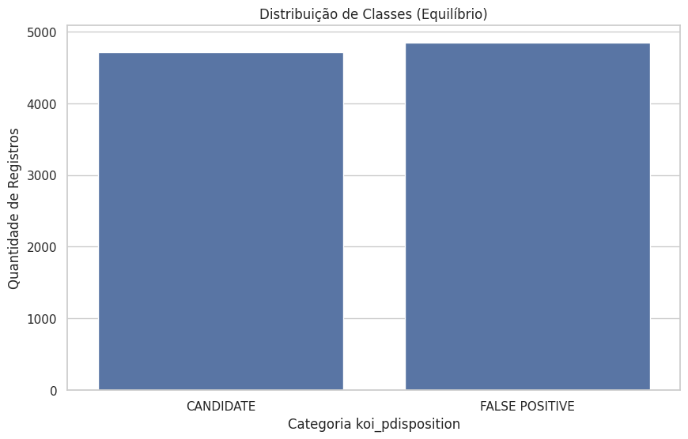
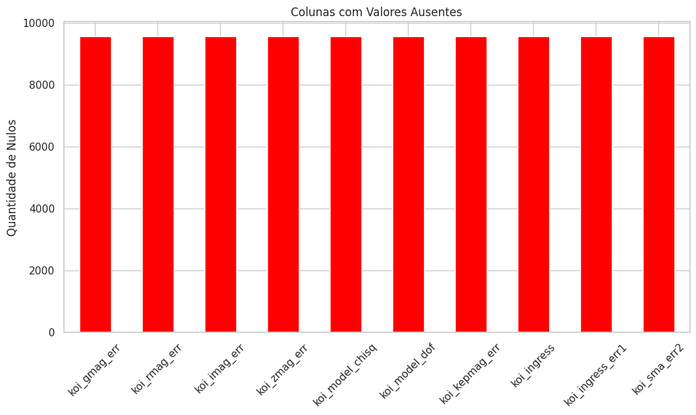
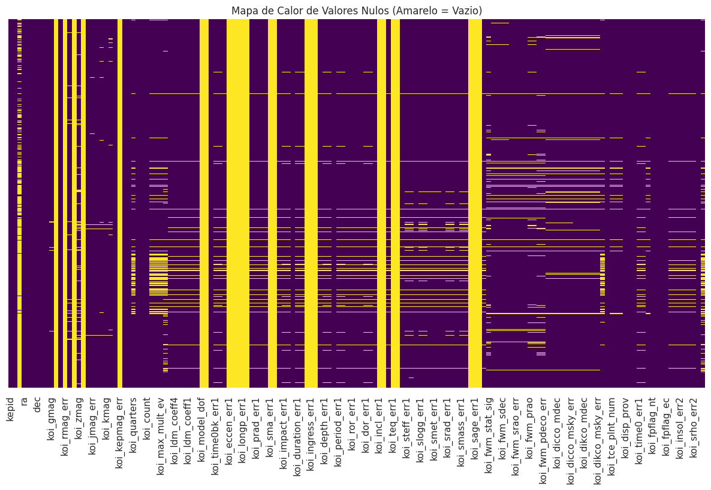
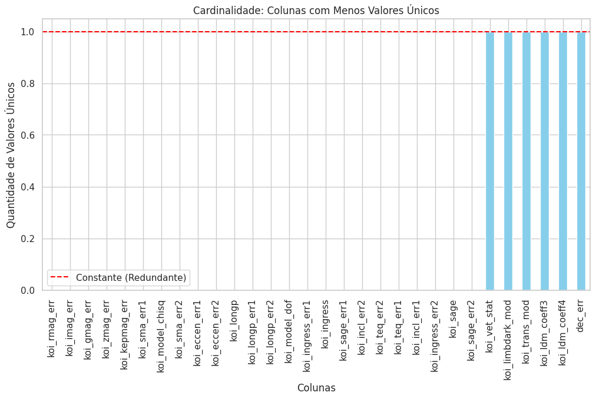
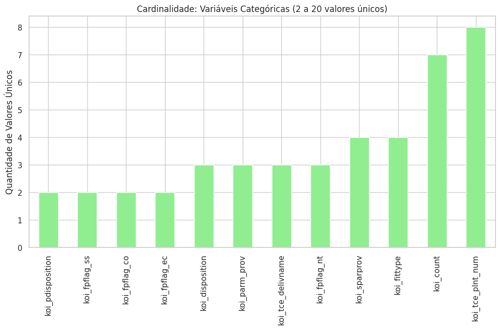
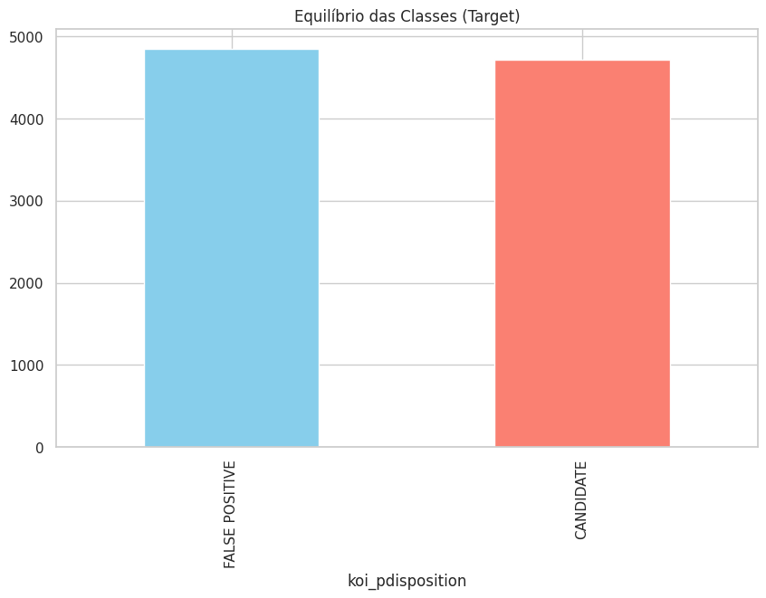
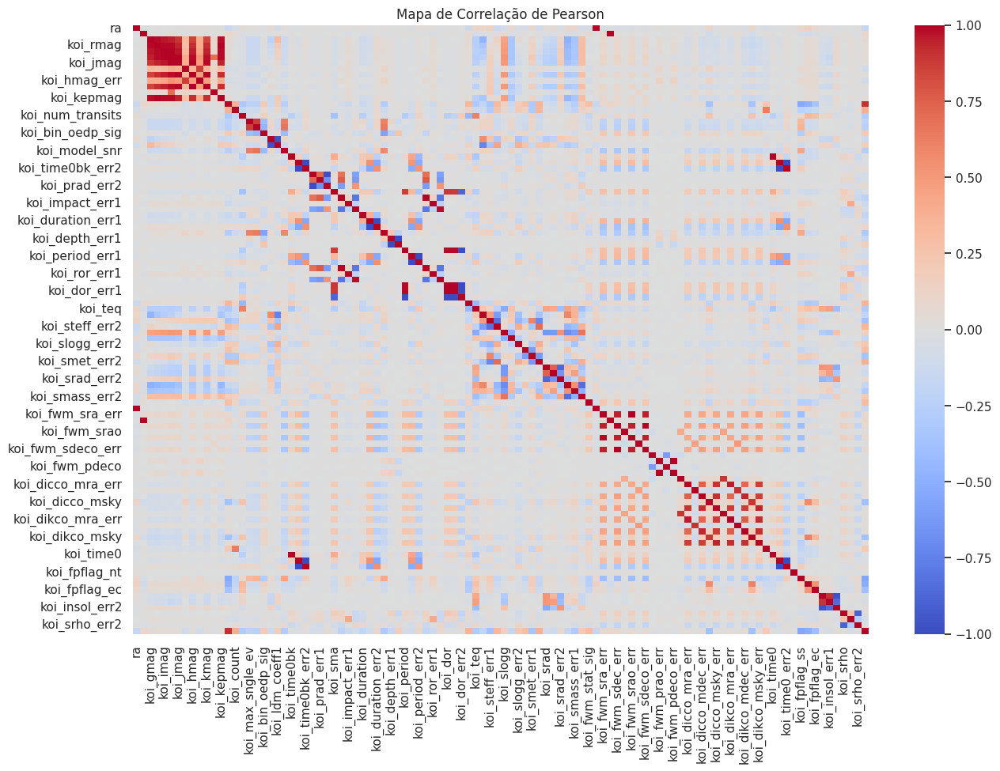
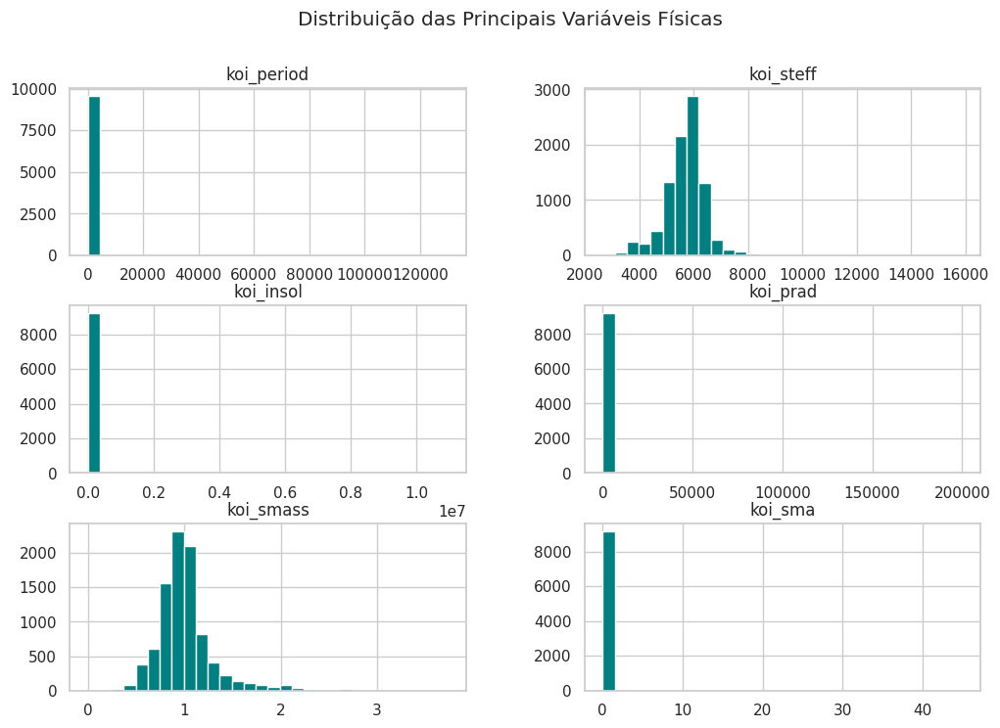

# Gráficos — Análise Exploratória de Dados (EDA)

Este documento reúne e descreve todos os gráficos gerados pelo notebook `notebooks/01_eda_koi.ipynb`, referente à etapa de Análise Exploratória do dataset **Kepler Objects of Interest (KOI)** da NASA.

---

## 1. Distribuição das Classes — `koi_pdisposition`

**O que representa:** Gráfico de barras que exibe a frequência de cada classe da variável-alvo `koi_pdisposition`. As duas classes possíveis são `CANDIDATE` (candidato a exoplaneta) e `FALSE POSITIVE` (falso positivo — sinal que não corresponde a um planeta real).

**Por que é relevante:** Permite avaliar se o dataset é **balanceado ou desbalanceado**. Um desequilíbrio significativo entre as classes poderia exigir técnicas como *oversampling* ou pesos de classe. Neste caso, as classes são próximas em quantidade (~50/50), o que favorece o treinamento direto sem ajustes adicionais.

---

## 2. Top Colunas com Mais Valores Nulos

**O que representa:** Gráfico de barras horizontais ordenado de forma decrescente, exibindo as colunas do dataset que apresentam a maior quantidade de valores ausentes (`NaN`).

**Por que é relevante:** Colunas com excesso de nulos comprometem o aprendizado do modelo. A regra adotada foi **remover todas as colunas com mais de 50% de valores nulos**, reduzindo o dataset de 153 para 121 atributos. Este gráfico fundamenta essa decisão de limpeza.

---

## 3. Mapa de Nulos Visualizado

**O que representa:** Visualização matricial (heatmap ou gráfico equivalente) dos valores ausentes em todo o dataset. Cada linha representa um registro e cada coluna representa um atributo; células destacadas indicam valores `NaN`.

**Por que é relevante:** Permite identificar **padrões de ausência** — por exemplo, se grupos inteiros de colunas estão ausentes para os mesmos registros, o que pode indicar dados faltantes sistemáticos relacionados ao instrumento Kepler ou ao processamento dos dados.

---

## 4. Cardinalidade: Variáveis Categóricas (2 a 20 valores únicos)

**O que representa:** Gráfico de barras com as colunas que possuem entre 2 e 20 valores únicos, ou seja, aquelas que se comportam como **variáveis categóricas** no contexto do dataset.

**Por que é relevante:** Auxilia na identificação de colunas que não são contínuas e precisam de tratamento especial (como *encoding*) antes do treinamento. Colunas com poucos valores únicos podem ser flags binárias ou categorias de classificação intermediária.

---

## 5. Barras — Distribuição de Variáveis com Poucos Valores Únicos

**O que representa:** Gráfico de barras complementar ao anterior, detalhando a **distribuição de frequência** dos valores para as colunas categóricas identificadas (aquelas com 2 a 20 categorias distintas).

**Por que é relevante:** Permite verificar se existe dominância de um único valor (colunas quase constantes), o que as tornaria pouco informativas para o modelo e candidatas à remoção.

---

## 6. Equilíbrio das Classes

**O que representa:** Gráfico que confirma e detalha a **proporção entre as classes** `CANDIDATE` e `FALSE POSITIVE` no dataset final (após limpeza inicial).

**Por que é relevante:** Reforça a conclusão de que o dataset é suficientemente balanceado para o treinamento supervisionado sem necessidade de técnicas de reamostragem. A distribuição equilibrada entre as classes garante que o modelo não será tendencioso para uma delas.

---

## 7. Valores Redundantes

**O que representa:** Análise e visualização de atributos com comportamento redundante — colunas que apresentam **correlação muito alta entre si** ou que são derivadas umas das outras (por exemplo, erros associados a medições cujos valores principais foram removidos).

**Por que é relevante:** Atributos redundantes não adicionam informação nova ao modelo e podem criar ruído ou multicolinearidade, prejudicando a convergência da rede neural. Identificá-los justifica a remoção de colunas derivadas e erros associados.

---

## 8. Principais Variáveis Físicas

**O que representa:** Visualização das **variáveis físicas mais relevantes** do dataset — atributos diretamente relacionados às características orbitais e estelares dos objetos de interesse, como período orbital (`koi_period`), raio do planeta (`koi_prad`), temperatura da estrela (`koi_steff`), entre outros.

**Por que é relevante:** Demonstra a natureza e a escala dos atributos que serão utilizados como entrada da rede neural. A grande diferença de escala entre eles (ex: período em dias vs. raio em Raios da Terra) justifica a necessidade do **escalonamento via `StandardScaler`** na etapa de pré-processamento.

---

## Referências

- Notebook original: [`notebooks/01_eda_koi.ipynb`](../notebooks/01_eda_koi.ipynb)
- Dataset: [NASA Exoplanet Archive — Cumulative KOI Table](https://exoplanetarchive.ipac.caltech.edu/docs/Kepler_KOI_docs.html)
