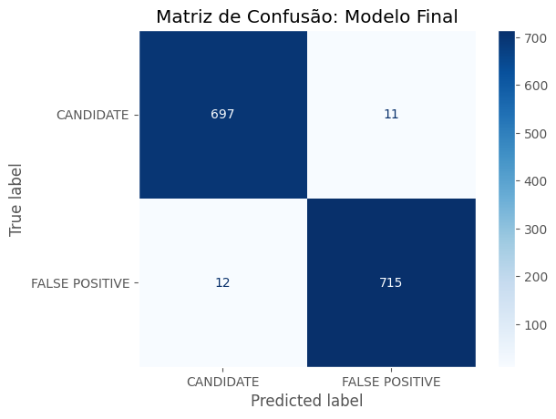
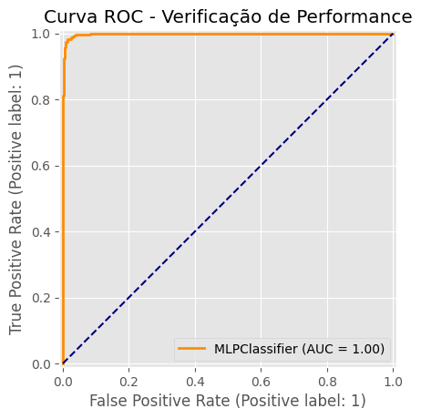
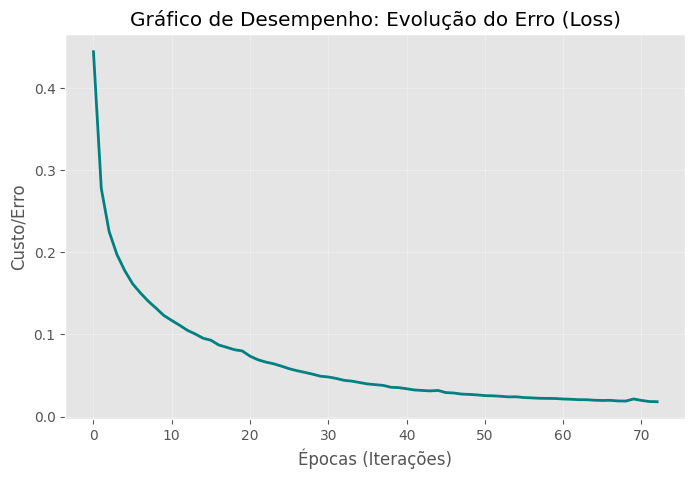

# Gráficos — Avaliação do Modelo (Pré-processamento e Modelagem)

Este documento reúne e descreve todos os gráficos gerados pelo notebook `notebooks/02_preprocessamento_modelagem.ipynb`, referente às etapas de pré-processamento, treinamento e avaliação dos modelos de classificação do dataset **KOI da NASA**.

---

## 1. Matriz de Confusão — Modelo Final (Exp C)

**O que representa:** A Matriz de Confusão é uma tabela 2×2 que compara as **predições do modelo final contra os rótulos reais** do conjunto de teste. Cada célula indica:

| | Predito: CANDIDATE | Predito: FALSE POSITIVE |
|---|---|---|
| **Real: CANDIDATE** | Verdadeiro Positivo (VP) | Falso Negativo (FN) |
| **Real: FALSE POSITIVE** | Falso Positivo (FP) | Verdadeiro Negativo (VN) |

**Modelo avaliado:** Experimento C — MLP com 1 camada oculta de 100 neurônios e regularização L2 (`alpha=0.01`), sobre o **conjunto de teste** (1.435 amostras, nunca vistas durante o treinamento).

**Como interpretar:** A diagonal principal (VP + VN) representa os acertos totais. Os valores fora da diagonal são os erros. A coloração em tons de azul (escala *Blues*) facilita a leitura visual: células mais escuras indicam maior concentração de predições.

**Por que é relevante:** A Matriz de Confusão vai além da acurácia simples — ela revela **onde o modelo erra**. Em problemas astronômicos como este, é especialmente importante saber se o modelo classifica falsos positivos como planetas reais (FP), o que seria um erro mais custoso do que o contrário.

---

## 2. Curva ROC — Verificação de Performance

**O que representa:** A Curva ROC (*Receiver Operating Characteristic*) plota a **Taxa de Verdadeiros Positivos (TPR/Recall)** contra a **Taxa de Falsos Positivos (FPR)** para todos os limiares de decisão possíveis do modelo. A linha diagonal tracejada em azul marinho representa um **classificador aleatório** (sem nenhum conhecimento), servindo como baseline de comparação.

**Métrica principal — AUC:** A Área Sob a Curva (AUC) é um número entre 0 e 1. Quanto mais próxima de 1, melhor o modelo em discriminar as duas classes. Um valor de AUC = 1.0 indica classificação perfeita; AUC = 0.5 equivale a um palpite aleatório.

**Por que é relevante:** A Curva ROC é uma métrica **independente do limiar de decisão**, o que a torna mais robusta que a acurácia isolada, especialmente em cenários onde o custo dos erros de cada tipo é diferente. No contexto da missão Kepler, identificar corretamente os candidatos a exoplanetas (maximizar TPR) sem gerar muitos alarmes falsos (minimizar FPR) é o objetivo central do modelo.

---

## 3. Gráfico de Desempenho — Evolução do Erro (Loss Curve)

**O que representa:** Gráfico de linha que registra a **evolução do erro (função de perda) a cada época de treinamento** da MLP final (Experimento C). O eixo X representa o número de épocas (iterações completas sobre os dados de treino) e o eixo Y representa o valor do custo calculado pelo otimizador Adam.

**Como interpretar:**
- Uma curva que **desce rapidamente e estabiliza** próxima a zero indica **boa convergência** — o modelo aprendeu os padrões sem dificuldade.
- Uma curva que **oscila ou não converge** indica instabilidade no treinamento (geralmente associada a *learning rate* inadequado ou dados mal escalonados).
- A convergência em **aproximadamente 70 épocas** neste projeto demonstra que o modelo aprendeu com eficiência, graças ao pré-processamento correto (escalonamento com `StandardScaler`) e à regularização L2 (`alpha=0.01`).

**Por que é relevante:** A curva de perda é o "log de aprendizado" da rede neural. Ela valida que o processo de otimização funcionou corretamente e permite identificar problemas como *underfitting* (curva não converge para baixo) ou *overfitting* (curva de treino cai mas a de validação sobe). O parâmetro `early_stopping=True` interrompe o treinamento automaticamente quando a melhora estagna.

---

## Tabela de Referência — Resultados dos Modelos

| Modelo | Acurácia (Validação) | Configuração | Status |
| :--- | :---: | :--- | :---: |
| Baseline (Regressão Logística) | 93,45% | N/A | Referência |
| MLP v1 | 98,33% | (100,) ReLU, Adam | Superado |
| Exp A — Profunda | 95,82% | (100, 50) | Descartado |
| Exp B — Larga | 96,59% | (200,) | Descartado |
| **Exp C — Regularizada** ⭐ | **98,40%** | **(100,) Alpha=0.01** | **Escolhido** |

> **Por que o Exp C foi escolhido?** Apresentou a maior acurácia de validação e a regularização L2 (`alpha=0.01`) reduz o risco de overfitting ao penalizar pesos muito grandes, tornando o modelo mais generalizável para dados novos.

---

## Referências

- Notebook original: [`notebooks/02_preprocessamento_modelagem.ipynb`](../notebooks/02_preprocessamento_modelagem.ipynb)
- Relatório do trabalho: [`docs/Relatorio.md`](../docs/Relatorio.md)
- Dataset: [NASA Exoplanet Archive — Cumulative KOI Table](https://exoplanetarchive.ipac.caltech.edu/docs/Kepler_KOI_docs.html)
